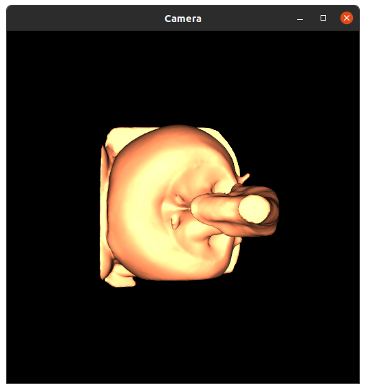
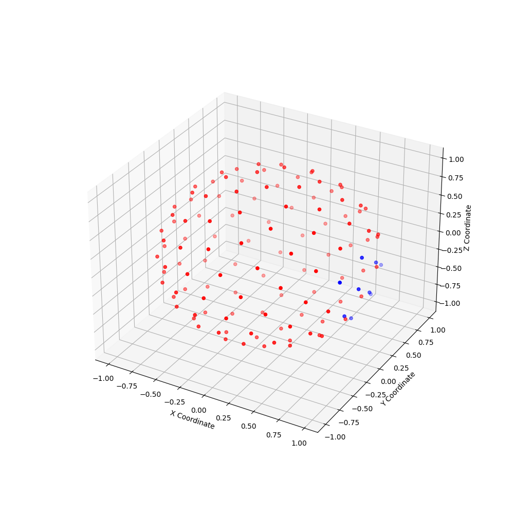

# ASSIST-U Features and Steps

---
### CT Segmentation

The current CT segmentation work in ASSIST-U is NOT maintained. It was previously worked on under Yifan (William) Wu. Details can be found in the original paper.

### Skeletonization

---

Skeletonization is performed using the skeletor library. It does not perform well in large cavernous regions atm. Several methods for skeletonization are available, but default uses wavefront contraction which we have found to perform best.

The _--contract_mesh_ argument can be enabled if you would like to improve skeletonization. Computation time is _very_ slow when the input surface mesh is large.

### Start Point Selection

---

After skeletonization, ASSIST-U will attempt to select the start point (typically the ureter) for camera view computation. If a location has not previously been selected, a window will open showing a render of the surface mesh. Right click on a point on the mesh and hit q or close the window.
ASSIST-U will search for the skeleton point closest to that point and begin generating camera views from there.

### Camera Point Generation

---
ASSIST-U will randomly generate n points within the specified local bending angle. The points are not guaranteed to be centered along the focal direction.
The below image shows an example. 9 points were generated with a 15 degree local bending angle. Blue points are taken as camera focal points while red points are rejected.

The sampling is performed according to a fibonnaci lattice. Because the number of points are unaligned, it is not guaranteed that exactly the same number of points will be generated each time. Thus weird oscillations may occur if num_points is 1 and local_bending is not 0.

Setting local bending to 0 will disable multiple camera views and sample directly along the skeleton axis.

### Rendering

---

ASSIST-U can render in either vtk or Unity. We have found Unity to produce better depth maps and lighting shadows. Setting up unity is detailed in [unity_setup](./unity_setup.md).