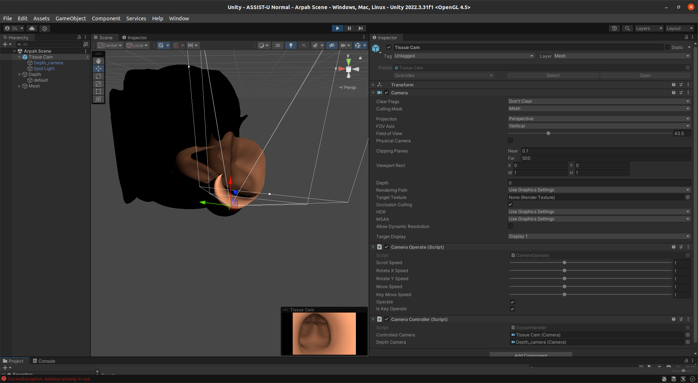

# Unity Setup

---

ASSIST-U can communicate with Unity to create renders instead of vtk. As long as a Unity scene is running, ASSIST-U will attempt to communicate and send commands over a local socket.

## Mesh details

---

Unity does not like rendering the insides of surface meshes with surface normals pointed outward. We have written two scripts to convert an stl into an obj for moving into Unity and flipping the normals. Simply run stl2obj.py and then FlipNormals.py witht he correct filenames to fix this issue.

All meshes should be loaded with position and rotation of (0,0,0). The camera will automatically be moved by ASSIST-U.

### Quick Setup

---

The fastest way to set up the scene is to import the prefabs in _unity_files_.

You should import the mesh twice, assign one to a layer named `Mesh` and the other named `Depth`.
The `Tissue Cam` prefab should be imported and added to the scene. Be sure that the top layer Tissue Cam is also assigned to Mesh and has Culling Mask set to Mesh. Similarly, the Depth Cam should have the corresponding layer and culling masks set.

If the Camera Controller Script does not exist at the bottom of Tissue Cam as shown in the image below, see Manual Setup.

### Manual Scene Setup

---

Create a new scene in Unity and delete all existing gameobjects.

Import all unity files in [ASSIST-U/unity_files](../unity_files) into the Project/Assets.

Create two cameras and a spotlight from under GameObject tab.
One camera should be the parent of the other two as shown in the picture above

Drag your surface mesh into a project folder below. Under Inspector->Materials point to [NewOrgan](../unity_files/NewOrgan.mat).
Change the color of your surface mesh by adjusting the Albedo of `NewOrgan`.

Make sure that after importing JetMaterial, the shader points to [JetShader](../unity_files/JetShader.shader).
Modify the depth maps by adjusting the Monochrome or JetColor methods of JetShader. They are called in the frag method.

Import your surface mesh with flipped surface normals (see Mesh Details above) twice.

Under Layers in the inspector of any object, add 2 layers, named `Mesh` and `Depth`.
Assign the parent camera, the spotlight, and one surface mesh to `Mesh`. Assign the child camera and the other surface mesh to Depth. Their names are not important so rename as convenient.

Add the [CameraOperate](../unity_files/CameraOperate.cs) and [Socket Handler](../unity_files/SocketHandler.cs) to the parent Camera. The former allows manipulation of the camera view when the scene is running and the latter allows communication with ASSIST-U.
Point controlled camera to the parent camera (tagged Mesh) and the depth camera to the child camera (tagged Depth).

Click on the depth camera and add the [Depth Script](../unity_files/depth_script.cs). Set the material to [JetMaterial](../unity_files/JetMaterial.mat) in the inspector.